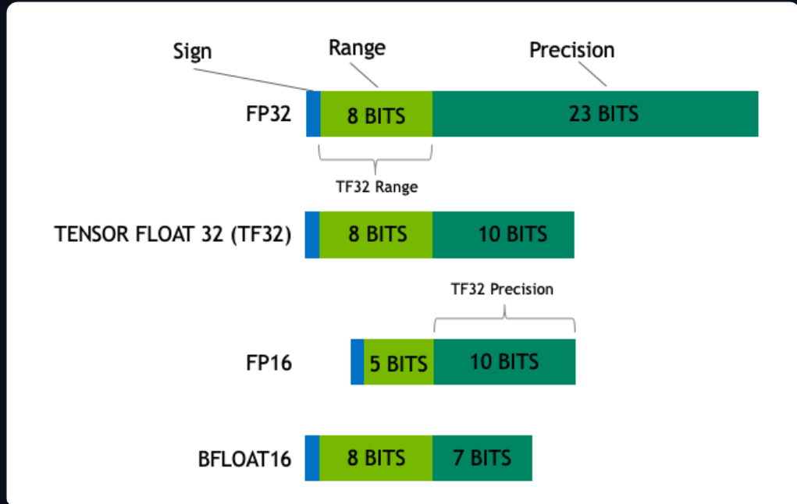
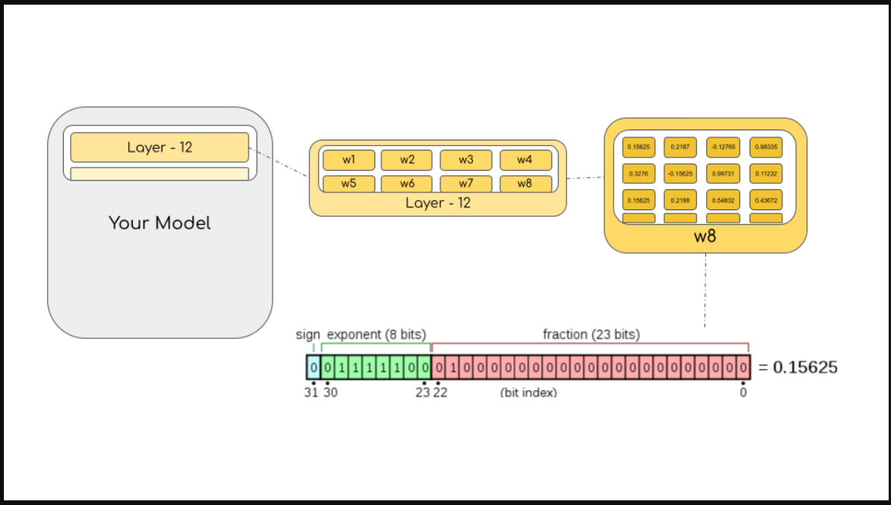

Floating point https://huggingface.co/blog/hf-bitsandbytes-integration 

# Exploring 
Large Language models are becoming larger.<br>
To do:-<br>
Inference on BLOOM-176B = 8x80GB A100 GPUs<br>
For FineTuning = 72 such GPUs.<br>
so we need to find some method to reduce these requirements.methods like `quantization`,`distillation` are used.<br>
`INT8`- does not degrade predictive performance of large models and reduces the memory footprint of large models by a factor or 2x<br>
Paper : [LLM.int8()](https://arxiv.org/abs/2208.07339)

### Common Data Types used in Machine Learning
- "precision" - floating point data types.<br>
- The size of a model is determined by the number of its parameters, and their precision, typically one of float32, float16 or bfloat16.<br><br>


#### FP32
- Flaot32(FP32) stands for the standardized IEEE 32-bit floating point representation.
- It can represent a wide range of floating point numbers
- in FP32 8 bits are reserved for "exponent" and 23 bits for "mantissa" and 1 bit for "sign"
- Currently most of the hardware supports FP32 operations and instructions

#### FP16
- 5 bits are reserved for "exponent",10bit are reserved for "matissa"
- so FP16 can only represent only few numbers compared to FP32
- This exposes FP16 numbes to the risk of `overflowing`(trying to represent a number that is very large) and `underflowing`(representing a number that is very small)
- largest number that can be represented is 64k

#### BF16
- created to avoid the constraints of FP16
- in BF16 we have 8 bits reserved for exponent(same as **FP32**) and 7 bits are reserved for the fraction.
- This means BF16 can retain the sam e dynamic range as FP32 but lose 3bits of precision with respect to FP16.Now there is no problem with huge numbers ,but the precision is worse than FP16

In `Ampere` architecture NVIDIA introduced [Tensorfloat-32](https://blogs.nvidia.com/blog/tensorfloat-32-precision-format/)(TF32) precision format combining the dynamic range of BF16 and precision of FP16 to use only 19bits , Its currently used internally during certain operations.<br>

- **In Machine Learning:**
    - FP32 = full precision (4 bytes)
    - BF16 and FP16 = half precision (2 bytes)
    - INT8 = 8 bit representation (store 2^8 from 0 to 255 or -128 to 127 for signed integers)


- Ideally the training and inference should be done in FP32 (two times slower than FP16/BF16),Therefore a mixed precision approach is used where the weights are help in FP32 as a precise "main weights" reference,while computation in a forward and backword pass are done in FP16/BF16 to enhance training speed. The FP16/BF16 gradients are used then to update the FP32 main weights.<br>
- During training, the main weights are always stored in FP32, but in practice, the half-precision weights often provide similar quality during inference as their FP32 counterpart -- a precise reference of the model is only needed when it receives multiple gradient updates. This means we can use the half-precision weights and use half the GPUs to accomplish the same outcome.<br>
<br>



### Introduction to model quantization
Experimentially, we have discovered that instead of using the 4-byte FP32 precision, we can get an almost identical inference outcome with 2-byte BF16/FP16 half-precision, which halves the model size.<br>It'd be amazing to cut it further, but the inference quality outcome starts to drop dramatically at lower precision.<br>
- To remediate that, we introduce 8-bit quantization. This method uses a quarter precision, thus needing only 1/4th of the model size! 
- **Quantization is done by essentially “rounding” from one data type to another.**

For example, if one data type has the range 0..9 and another 0..4, then the value “4” in the first data type would be rounded to “2” in the second data type. However, if we have the value “3” in the first data type, it lies between 1 and 2 of the second data type, then we would usually round to “2”. This shows that both values “4” and “3” of the first data type have the same value “2” in the second data type. This highlights that quantization is a noisy process that can lead to information loss, a sort of lossy compression.

- Most common 8-bit quantization techniques are
    - zero-point quantization
    - absolute maximum (absmax) quantization

- Zero-point quantization and absmax quantization map the floating point values into more compact int8 (1 byte) values. First, these methods normalize the input by scaling it by a quantization constant.
- **Range Mapping:**  
  - Original value range: -1.0 to 1.0  
  - Target 8-bit range: -127 to 127

- **Quantization Process:**  
  - Multiply the original value by 127.  
  - Example: 0.3 × 127 = 38.1, then round to 38.

- **Dequantization Process:**  
  - Divide the quantized integer (e.g., 38) by 127 to retrieve an approximate original value.  
  - Example: 38 ÷ 127 ≈ 0.2992

- **Quantization Error:**  
  - The difference between the original (0.3) and the dequantized value (0.2992) is approximately 0.008.  
  - These small errors can accumulate across layers, potentially degrading model performance.
  ### **Absmax Quantization Simplified**  

- **How It Works:**  
  - Find the **absolute maximum** value in the tensor.  
  - Scale all values by dividing with this max value.  
  - Multiply by the **int8 range** (-127 to 127).  

- **Example Calculation:**  
  - Given vector: **[1.2, -0.5, -4.3, 1.2, -3.1, 0.8, 2.4, 5.4]**  
  - **Absolute max = 5.4**  
  - Compute scaling factor: **127 ÷ 5.4 = 23.5**  
  - Multiply each value by **23.5**, then round:  
    → **[28, -12, -101, 28, -73, 19, 56, 127]**  

- **Getting Back the Original Values:**  
  - Divide the int8 values by **23.5**.  
  - Some precision loss occurs due to rounding.  

- **Unsigned int8 Variant:**  
  - Subtract the **minimum value** and scale by the absolute max.  
  - Similar to **min-max scaling** but keeps 0 as an integer without error.  

- **Vector-wise Quantization:**  
  - Instead of using **one max value per tensor**, use:  
    - Max of **each row** in matrix A.  
    - Max of **each column** in matrix B.  
  - Normalize A & B → Multiply → **Denormalize the result**.  
  - Gives more accurate results in **matrix multiplication**.  

- **Why It Matters:**  
  - Helps in compressing deep learning models.  
  - **Basic quantization reduces accuracy** in large models.  
  - **LLM.int8() solves this**, keeping performance intact for models up to **176B parameters (e.g., BLOOM)**.

## Usage
### **1. Core Module: Linear8bitLt**

- **Purpose:**  
  - Implements 8‑bit matrix multiplication for transformer layers.
  - Derived from a standard `torch.nn.Module` but uses 8‑bit quantization for memory efficiency.

- **Usage Steps:**
  1. **Imports:**
     - `import torch`
     - `import torch.nn as nn`
     - `import bitsandbytes as bnb`
     - `from bnb.nn import Linear8bitLt`
  2. **Define a FP16 Model:**
     - Create a simple model (e.g., using `nn.Sequential` with `nn.Linear` layers).
     - *Note:* Although checkpoints of any precision (FP16, BF16, FP32) can be converted, the model input must be FP16 for the Int8 module to work.
     - Example:
       ```python
       fp16_model = nn.Sequential(
           nn.Linear(64, 64),
           nn.Linear(64, 64)
       )
       ```
  3. **Save the Trained FP16 Model:**
     - Use `torch.save(fp16_model.state_dict(), "model.pt")`.
  4. **Define an INT8 Model:**
     - Replace standard linear layers with `Linear8bitLt` layers.
     - **Important:** Set `has_fp16_weights=False` to enable memory‑efficient inference (default is `True` for mixed precision training).
       ```python
       int8_model = nn.Sequential(
           Linear8bitLt(64, 64, has_fp16_weights=False),
           Linear8bitLt(64, 64, has_fp16_weights=False)
       )
       ```
  5. **Load and Quantize the Model:**
     - Load the saved state dict into the int8 model.
     - Move the model to the GPU using `.to(0)`, which triggers the quantization.
       ```python
       int8_model.load_state_dict(torch.load("model.pt"))
       int8_model = int8_model.to(0)  # Quantization happens here
       ```
  6. **Observing Quantization:**
     - Before calling `.to(0)`, the layer weights are in FP16.
     - After, weights are quantized to INT8 (values in the range of –127 to 127).
     - To retrieve approximate FP16 values (for outlier matrix multiplication), use:
       ```python
       (int8_model[0].weight.CB * int8_model[0].weight.SCB) / 127
       ```
     - The retrieved values closely match the original FP16 weights.

---

### **2. Differences from Standard nn.Linear**

- **Parameter Type:**  
  - The parameters in `Linear8bitLt` come from the `bnb.nn.Int8Params` class rather than the usual `nn.Parameter`.

- **Impact:**  
  - This difference required additional modifications and debugging during integration.

---

### **3. Using Accelerate for Large Models**

- **init_empty_weights:**
  - Accelerate’s `init_empty_weights` context manager allows initializing huge models on PyTorch’s meta device (which allocates no actual memory).
  - Example:
    ```python
    from accelerate import init_empty_weights
    with init_empty_weights():
        model = nn.Sequential([nn.Linear(100000, 100000) for _ in range(1000)])  # Takes ~0 RAM
    ```
- **Custom Integration Challenges:**
  - By default, `init_empty_weights` converts parameters to `torch.nn.Parameter`, but for 8‑bit modules, the Int8Params must be preserved.
  - A PR modified this behavior to maintain the parameter class (Int8Params) while still moving them to the meta device.

- **Layer Replacement Utility:**
  - A custom recursive function (`replace_8bit_linear`) is used to:
    - Traverse the model initialized on the meta device.
    - Replace all `nn.Linear` layers (except specified ones like `lm_head`) with `bnb.nn.Linear8bitLt` layers.
    - Ensure `has_fp16_weights=False` is set.
  - This function ensures the model remains on the meta device until accelerate manually loads parameters and dispatches them to the correct GPU.

- **Device Dispatching Nuances:**
  - Special care is required when calling `.to()` to avoid triggering quantization multiple times.
  - A custom function (`set_module_8bit_tensor_to_device`) was implemented to handle device setting without duplicate calls.
  - Two pull requests were needed to resolve issues with device dispatching and parameter loading.

---

### **4. Hardware Requirements & Installation**

- **Hardware:**
  - 8‑bit tensor cores are supported on GPUs (Turing and Ampere architectures, e.g., RTX 20/30 series, A40, A100, T4+).
  - CPUs do not support 8‑bit tensor cores.
  - Google Colab typically provides NVIDIA T4 GPUs which support 8‑bit tensor cores.

- **Installation Commands:**
  - `pip install accelerate`
  - `pip install bitsandbytes`
  - `pip install git+https://github.com/huggingface/transformers.git`

---

### **5. Example Demos**

- **T5‑11B Demo:**
  - The original T5‑11B checkpoint in FP32 uses 42 GB of memory.
  - With 8‑bit quantization, it only uses 11 GB, making it runnable on Google Colab.
  - [Open In Colab: T5-11b demo](#)

- **BLOOM‑3B Demo:**
  - Also available as an 8‑bit inference demo.
  - [Open In Colab: BLOOM-3b demo](#)

---

### **6. Scope for Future Improvements**

- **Inference Speed:**
  - For smaller models (≤6B parameters), further speed improvements are possible (potentially recovering fp16-level performance or achieving small speedups).

- **Older GPU Support:**
  - Planned support for Kepler GPUs (e.g., GTX 1080) which have Int8 vector units even though they lack dedicated 8‑bit tensor cores.
  - This requires a different software stack for fast inference.

- **State Dict Saving on the Hub:**
  - Currently, 8‑bit state dicts (which lack quantization statistics such as `CB` and `SCB`) cannot be directly loaded.
  - Future work may enable saving and loading these statistics to improve accessibility.

- **CPU Support:**
  - 8‑bit operations are not currently supported on CPUs.
  - Enabling CPU support would improve usability and accessibility.

- **Application to Other Modalities:**
  - While currently focused on language models, the technique could potentially be extended to large vision, audio, and multimodal models.

---

### **7. Overall Impact and Summary**

- **Accessibility:**
  - The integration of 8‑bit quantization into Hugging Face Transformers greatly reduces memory requirements, enabling very large models to be run on fewer GPUs.
  
- **Performance:**
  - The LLM.int8() method maintains predictive performance (nearly zero degradation) even for extremely large models (e.g., BLOOM‑176B).
  
- **Integration Effort:**
  - The process involved careful modifications, custom utilities, and extensive testing, especially with regard to device dispatching and parameter replacement.
  
- **Result:**
  - Users with limited computational resources can now access and use models that were previously too large to run, opening up new possibilities for research and application.

---

This summary captures all the key points and nuances of the Hugging Face Transformers integration as described in the blog post.